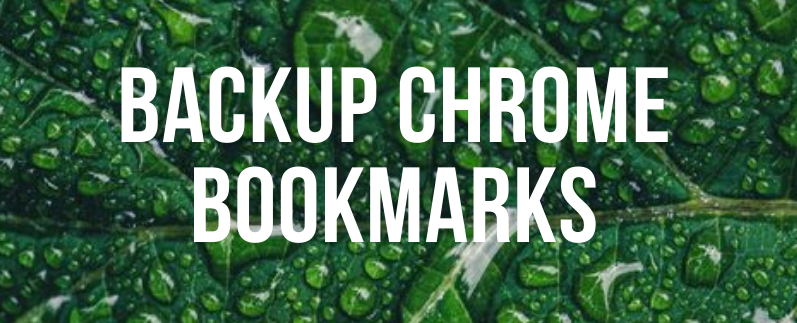

<!-- markdownlint-disable MD025 -->
# Make a backup of your Chrome bookmarks to your physical machine



This script will make a backup of your Chrome bookmarks and
will copy them on your physical laptop. Please note that your
bookmarks on your laptop will be overwritten.

This code should be fired from the Virtual machine.

## Initialization

Please edit this script and edit the `$profile` variable to match
your network user name on your physical machine (your laptop).
If you don't know that name, just run `echo %USERPROFILE%`. You'll
then get something like `C:\Users\Christophe`. Here, the
`$profile` variable has to be initialized to `Christophe`.

## Run the script

### Manually

Start a DOS Prompt Session and just run this script like this

```bash
powershell -ExecutionPolicy Bypass -File BackupChromeBookmarks.ps1
```

### Automatically

Add the script in the Global Policy as a "Logoff script" f.i.

1. Start `gpedit.msc`
2. Expand `Local Computer Policy`
3. Expand `User Configuration`
4. Expand `Windows Settings`
5. Click on `Scripts (Logon/Logoff)`
6. In the right part, double-click on `Logon` or `Logoff` depending on your choice
7. In the new windows, click on the `PowerShell scripts` tab
8. Click on the `Add...` button
9. Click on the `Browse...` button near the `Script Name:` field and retrieve the full path to this `.ps1` script
10. Click on the `Ok` button
11. Click on the `Ok` button in the `Logon Properties` (or `Logoff Properties`) window

You script is now in place and will be fired by Windows when you'll make a logon or a logoff.

## Remark

This script has no output on the console except when there is an error.
If you didn't see something, this means that the backup has been made successfully.
